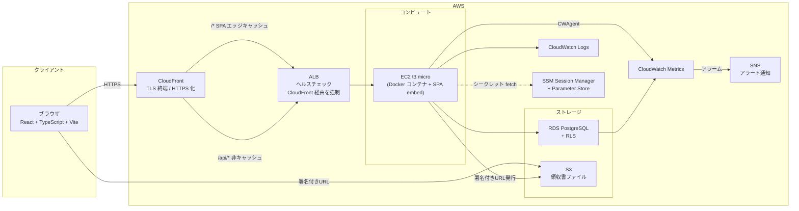

# 経費精算SaaS

マルチテナント型の経費精算 SaaS。下書き → 提出 → 承認 → 支払のワークフローを、4 ロールの RBAC とテナント分離（アプリ層 + RLS の二重保証）で制御する Web アプリケーション。

**公開デモ**: https://djhmwtrr79jdq.cloudfront.net/

個人プロジェクト。要件定義から AWS デプロイ・UAT 完走までを 1 人で実施。設計判断の言語化（ADR 7 件）・テスト戦略・運用設計を含めたエンジニアリングプロセス全体をポートフォリオとして公開している。

---

## 公開デモ

| 項目 | 値 |
|---|---|
| URL | https://djhmwtrr79jdq.cloudfront.net/ |
| 配信 | CloudFront（HTTPS 終端） → ALB → EC2 t3.micro |

> 公開デモは複数の閲覧者で共有されるため、入力したデータ・アップロードしたファイルは他の閲覧者から見える可能性がある。**機密情報や実ファイルはアップロードしないこと**。動作確認はサンプルデータでお願いします。

### テストアカウント

パスワード共通: `TestPass1!`

| メールアドレス | ロール | テナント |
|---|---|---|
| test-admin@example.com | Admin | Test Company A |
| test-approver@example.com | Approver | Test Company A |
| test-approver2@example.com | Approver | Test Company A |
| test-member@example.com | Member | Test Company A |
| test-member-empty@example.com | Member（データなし） | Test Company A |
| test-accounting@example.com | Accounting | Test Company A |
| test-approver-b@example.com | Approver | Test Company B |
| test-member-b@example.com | Member | Test Company B |

> テナント B のアカウントでログインすると、テナント A のレポートが一切見えないこと（テナント分離）を確認できる。
> 公開デモは費用都合により予告なく停止する可能性がある。

---

## このプロジェクトについて

### プロダクト概要

中小規模の組織を想定した SaaS 型の経費精算アプリケーション。MVP の機能境界は「経費レポートの作成・提出・承認・却下・支払完了」までの一連のワークフローを 4 ロール（Admin / Approver / Member / Accounting）の RBAC とテナント分離で制御することに絞り込んでいる。スコープ詳細は [`02_scope.md`](https://github.com/atsuro128/dev-journal/blob/master/deliverables/docs/02_scope.md) を参照。

### 何を示したいプロジェクトか

「動くものを作った」ではなく、**業務 SaaS で問われる設計判断と品質保証を一通り通せること** を示すことを目的としている。具体的には以下。

1. **マルチテナント設計**: 全クエリでの `tenant_id` 強制 + PostgreSQL RLS による二重保証（[ADR-0003](https://github.com/atsuro128/dev-journal/blob/master/deliverables/docs/30_arch/adr/0003-rls-tenant-isolation.md)）
2. **RBAC**: 4 ロール × ミドルウェア検証 × 所有権チェック（リソース所有者のみ操作可）
3. **業務フローの厳密実装**: 状態遷移（draft → submitted → approved → paid / rejected）をドメイン層で制御、不正遷移はエラー
4. **設計判断の記録**: 技術選定の判断根拠を ADR 7 件で明文化（[adr/](https://github.com/atsuro128/dev-journal/tree/master/deliverables/docs/30_arch/adr)）
5. **テスト戦略**: テナント分離 / RBAC / 状態遷移を重点項目として明示し、ユニット〜E2E まで設計（[60_test/](https://github.com/atsuro128/dev-journal/tree/master/deliverables/docs/60_test)）
6. **運用設計**: 構造化ログ・CloudWatch メトリクス・ヘルスチェック・アラート方針を含めた運用設計（[ADR-0005](https://github.com/atsuro128/dev-journal/blob/master/deliverables/docs/30_arch/adr/0005-monitoring-logging.md)）

---

## 技術スタック

| 領域 | 採用技術 | 選定理由（要約） |
|---|---|---|
| バックエンド | Go 1.24 / Chi / sqlc / pgx | 型安全な SQL（sqlc） + 軽量ルータ。詳細は [ADR-0001](https://github.com/atsuro128/dev-journal/blob/master/deliverables/docs/30_arch/adr/0001-tech-stack.md) |
| 認証 | JWT (RS256) + Argon2id | 公開鍵検証で API ステートレス化。Argon2id は OWASP 推奨。詳細は [ADR-0006](https://github.com/atsuro128/dev-journal/blob/master/deliverables/docs/30_arch/adr/0006-jwt-signing-algorithm.md) |
| フロントエンド | React 19 / TypeScript / Vite 6 / MUI 6 / TanStack Query | サーバー状態は TanStack Query で集約 |
| DB | PostgreSQL 16 + RLS | Shared DB + tenant_id 方式、RLS でセーフティネット。詳細は [ADR-0002](https://github.com/atsuro128/dev-journal/blob/master/deliverables/docs/30_arch/adr/0002-multi-tenant.md) / [ADR-0003](https://github.com/atsuro128/dev-journal/blob/master/deliverables/docs/30_arch/adr/0003-rls-tenant-isolation.md) |
| オブジェクトストレージ | S3 (本番) / MinIO (ローカル) | 領収書ファイル。署名付き URL 配信（テナントプレフィックス分離） |
| インフラ | AWS（CloudFront / ALB / EC2 t3.micro / RDS / S3 / CloudWatch / SSM） | Free Tier 範囲のポートフォリオ構成。詳細は [ADR-0004](https://github.com/atsuro128/dev-journal/blob/master/deliverables/docs/30_arch/adr/0004-infra.md) / [ADR-0007](https://github.com/atsuro128/dev-journal/blob/master/deliverables/docs/30_arch/adr/0007-cloudfront-https.md) |
| IaC | Terraform | VPC / ALB / EC2 / RDS / S3 / CloudFront 等を全て管理 |
| ローカル開発 | Docker Compose | api / frontend / db / minio / migrate / seed をコード化 |
| CI / デプロイ | GitHub Actions（参考実装、`workflow_dispatch` 手動実行、ECS デプロイはコメントアウト） + ローカル `/test` スキル | Free Tier 制約のため CI は参考実装、ローカル実行が正規の品質ゲート |

---

## 主要機能

| 領域 | 機能 |
|---|---|
| 認証 | サインアップ / ログイン / トークンリフレッシュ / ログアウト / パスワードリセット（メール送信は post-MVP） |
| 経費レポート | 作成・編集・削除（draft のみ）・一覧（自分） / 詳細閲覧 |
| 経費明細 | 追加・編集・削除、6 カテゴリ（交通費・宿泊費・飲食費・消耗品費・通信費・その他） |
| 添付ファイル | 領収書アップロード（JPEG/PNG/PDF、5MB 以下）、署名付き URL によるダウンロード |
| ワークフロー | 提出（Member）/ 承認・却下（Approver、自申請は不可）/ 支払完了（Accounting） |
| 一覧画面 | 自分のレポート / 承認待ち / 支払待ち / テナント全レポート（Admin・Accounting） |
| ダッシュボード | ロール別の件数サマリー |
| テナント管理 | 会社情報閲覧（Admin）、メンバー一覧取得 |
| 横断 | レート制限（認証済み 100 req/min/user）、CORS、HSTS 等のセキュリティヘッダー |

---

## アーキテクチャ

### システム構成



### バックエンドのレイヤー構成

```
ミドルウェアチェーン → ハンドラ → サービス → ドメイン → リポジトリ → PostgreSQL
```

| レイヤー | 責務 |
|---|---|
| ミドルウェア | CORS → SecurityHeaders → RequestID → Logger → RateLimit → Auth(JWT) → TenantContext(RLS) → RBAC |
| ハンドラ | リクエスト/レスポンスの変換、入力バリデーション |
| サービス | ユースケース、トランザクション管理、所有権・ビジネスルール判定 |
| ドメイン | エンティティ・値オブジェクト、状態遷移制御、不変条件検証 |
| リポジトリ | sqlc 生成コード、`tenant_id` フィルタの強制、論理削除の適用 |

詳細は [`architecture.md`](https://github.com/atsuro128/dev-journal/blob/master/deliverables/docs/30_arch/architecture.md) / 図一覧は [`diagrams.md`](https://github.com/atsuro128/dev-journal/blob/master/deliverables/docs/30_arch/diagrams.md) を参照。

### セキュリティ多層防御

ネットワーク（CloudFront ヘッダ検証）→ トランスポート（HSTS / CORS）→ 認証（JWT RS256）→ 認可（RBAC + 所有権）→ データアクセス（`tenant_id` 強制 + RLS）→ 出力制御（テナント越境は 404）の 6 層で実装している。詳細は [`security.md`](https://github.com/atsuro128/dev-journal/blob/master/deliverables/docs/50_detail_design/security.md) / [`authz.md`](https://github.com/atsuro128/dev-journal/blob/master/deliverables/docs/50_detail_design/authz.md) を参照。

---

## 技術的ハイライト

### テナント分離（二重保証）

`TenantContext` ミドルウェアが JWT claims から `tenant_id` を取り出し、コネクションを固定したまま `SET LOCAL app.current_tenant` で RLS の検査用変数に値を設定する。リポジトリ層は sqlc 生成クエリで `WHERE tenant_id = $1` を明示し、RLS ポリシーはセーフティネットとして WHERE 句の漏れを防ぐ。他テナントのリソースへのアクセスは情報漏洩を防ぐため 404 を返す。

### 状態遷移の厳密制御

経費レポートの状態は draft / submitted / approved / rejected / paid の 5 種類。遷移はドメイン層に閉じ込めており、ハンドラ層から直接ステータスを書き換えることはできない。自己承認の禁止・空レポート提出の禁止・却下理由の必須化など、業務ルールはすべてドメインエラーとして表現している（14 種類）。

### 設計判断の記録（ADR）

技術選定の判断理由を 7 件の ADR で明文化している。「なぜその技術を選んだか」「代替案との比較」「将来のスケール時の限界」を残すことで、判断の追跡可能性を担保している。

| ADR | テーマ |
|---|---|
| [0001](https://github.com/atsuro128/dev-journal/blob/master/deliverables/docs/30_arch/adr/0001-tech-stack.md) | 技術スタック・主要ライブラリの選定理由 |
| [0002](https://github.com/atsuro128/dev-journal/blob/master/deliverables/docs/30_arch/adr/0002-multi-tenant.md) | マルチテナント方式（Shared DB + tenant_id） |
| [0003](https://github.com/atsuro128/dev-journal/blob/master/deliverables/docs/30_arch/adr/0003-rls-tenant-isolation.md) | RLS テナント分離方式の判断根拠 |
| [0004](https://github.com/atsuro128/dev-journal/blob/master/deliverables/docs/30_arch/adr/0004-infra.md) | インフラ選定（コンピュート / DB / ストレージ） |
| [0005](https://github.com/atsuro128/dev-journal/blob/master/deliverables/docs/30_arch/adr/0005-monitoring-logging.md) | 監視・ログ戦略 |
| [0006](https://github.com/atsuro128/dev-journal/blob/master/deliverables/docs/30_arch/adr/0006-jwt-signing-algorithm.md) | JWT 署名アルゴリズム選定 |
| [0007](https://github.com/atsuro128/dev-journal/blob/master/deliverables/docs/30_arch/adr/0007-cloudfront-https.md) | CloudFront による HTTPS 化 |

---

## 開発プロセス

要件定義 → 設計 → 実装 → テスト → デプロイ → UAT を段階的に進める計画駆動型のプロセスで進めている。各 Step の成果物・進捗・意思決定ログ・発見した issue は [`dev-journal/`](https://github.com/atsuro128/dev-journal) に一通り残してある。

| Step | 内容 | 主な成果物 |
|---|---|---|
| 1 | 要件定義 | [requirements.md](https://github.com/atsuro128/dev-journal/blob/master/deliverables/docs/10_requirements/requirements.md), [usecases.md](https://github.com/atsuro128/dev-journal/blob/master/deliverables/docs/10_requirements/usecases.md) |
| 2 | ドメイン設計 | [20_domain/](https://github.com/atsuro128/dev-journal/tree/master/deliverables/docs/20_domain) |
| 3 | アーキテクチャ設計 | [architecture.md](https://github.com/atsuro128/dev-journal/blob/master/deliverables/docs/30_arch/architecture.md), [ADR](https://github.com/atsuro128/dev-journal/tree/master/deliverables/docs/30_arch/adr) |
| 4 | 基本設計 | [40_basic_design/](https://github.com/atsuro128/dev-journal/tree/master/deliverables/docs/40_basic_design) |
| 5 | 詳細設計（API / DB / 認可 / セキュリティ） | [50_detail_design/](https://github.com/atsuro128/dev-journal/tree/master/deliverables/docs/50_detail_design) |
| 5.5 | UI コンポーネント設計 | [55_ui_component/](https://github.com/atsuro128/dev-journal/tree/master/deliverables/docs/55_ui_component) |
| 6 | テスト設計 | [60_test/](https://github.com/atsuro128/dev-journal/tree/master/deliverables/docs/60_test) |
| 7 | 運用設計 | [70_operations/](https://github.com/atsuro128/dev-journal/tree/master/deliverables/docs/70_operations) |
| 8 | 基盤構築 | Terraform / Docker Compose / CI |
| 9 | テストコード実装 | unit / integration / E2E |
| 10 | 機能実装 | バックエンド / フロントエンド |
| 11 | システムテスト・UAT | 全 36 項目実施、35 PASS + 1 既知未実装スキップ（UAT-023 = issue #151 post-MVP）、ブロッカー 0（2026-05-28） |

進捗は [`progress-management/progress.md`](https://github.com/atsuro128/dev-journal/blob/master/progress-management/progress.md)、検出された issue とその扱いは [`issues/`](https://github.com/atsuro128/dev-journal/tree/master/issues) を参照。

実装作業の効率化として、Claude Code（AI コーディングエージェント）と自作の開発フレームワーク（[`ai-dev-framework/`](https://github.com/atsuro128/ai-dev-framework)）を併用している。役割別エージェント（architect / designer / backend / frontend / test-implementer / reviewer 等）を切り替えながら開発を進める運用とした。設計判断・レビュー判定・コミット・マージ等の責任ある判断は人間が行い、AI は実装・調査・草案作成の労力削減手段として位置づけている。

---

## リポジトリ構成

本プロジェクトは 4 つのリポジトリで構成されている。

| リポジトリ | 役割 |
|---|---|
| [`expense-saas/`](.) | プロダクト本体（実装コード） |
| [`dev-journal/`](https://github.com/atsuro128/dev-journal) | 開発プロセス記録（設計成果物・進捗・issue・ログ） |
| [`ai-dev-framework/`](https://github.com/atsuro128/ai-dev-framework) | AI 駆動開発フレームワーク（エージェント定義・ワークフロー・テンプレート） |
| [`root-project/`](..) | メタリポジトリ（CLAUDE.md による全体統括） |

---

## ローカル開発

### 前提条件

- Docker / Docker Compose v2
- `./scripts/generate-keys.sh` に必要な OpenSSL

### セットアップ

#### 1. JWT 鍵ペアの生成（初回のみ）

```bash
./scripts/generate-keys.sh
```

`keys/private.pem` と `keys/public.pem` が生成される。生成した鍵ファイルはリポジトリにコミットしない。

#### 2. 環境変数ファイルの準備（初回のみ）

```bash
cp .env.example .env
```

`.env` はデフォルト値のままで動作する（変更不要）。`.env` はリポジトリにコミットしない。

#### 3. 通常開発サービス起動

```bash
docker compose up -d
```

| サービス | 役割 |
|---|---|
| `db` | PostgreSQL 16（開発用、ポート 5432） |
| `db-test` | PostgreSQL 16（テスト専用、ポート 5433。`go test -tags integration` で使用） |
| `migrate` | マイグレーション（自動適用後に終了） |
| `minio` | S3 互換オブジェクトストレージ |
| `minio-init` | MinIO 初期バケット作成後に終了 |
| `api` | Go バックエンド |
| `frontend` | React / Vite 開発サーバー |

profile 指定が必要なサービス（通常起動では立ち上がらない）:

| サービス | profile | 役割 |
|---|---|---|
| `seed` | `seed` | 開発用フィクスチャ投入（`make seed` がワンショット実行） |
| `migrate-test` | `test` | `db-test` 向けマイグレーション |
| `test-be` | `test` | バックエンド統合テスト実行 |

マイグレーション（`000001`〜）は `migrate` コンテナが自動適用するため手動実行は不要。

#### 4. 開発用フィクスチャ投入

```bash
make seed
```

内部で `docker compose --profile seed run --rm seed` を実行する。`depends_on` で `migrate` と `minio-init` の完了を自動待機するため、起動順序エラーは通常発生しない。冪等性を担保しているため複数回実行しても問題ない。

投入されるデータの詳細は [`test_strategy.md §4.2/4.3/4.4`](https://github.com/atsuro128/dev-journal/blob/master/deliverables/docs/60_test/test_strategy.md) を参照。

### アクセス先

| URL | 説明 |
|---|---|
| http://localhost:5173 | フロントエンド |
| http://localhost:8080 | API サーバー |
| http://localhost:8080/health | ヘルスチェック |

### ローカル用テストアカウント

公開デモと同じアカウントが投入される（パスワード共通: `TestPass1!`）。詳細は本ドキュメント上部の「テストアカウント」表を参照。

### 停止・リセット

```bash
# コンテナ停止（データ保持）
docker compose down

# コンテナ停止 + ボリューム削除（DB・MinIO データを完全リセット）
docker compose down -v
```

完全リセット後は `docker compose up -d` と `make seed` を再実行する。

### よくある問題

#### port が使用中（Address already in use）

`.env` で変更する。

```bash
POSTGRES_PORT=5434
API_PORT=8081
FRONTEND_PORT=5174
```

#### JWT 鍵エラー（keys/private.pem が見つからない）

初回セットアップ手順 1 を実施していない。`./scripts/generate-keys.sh` を実行する。

#### DB ヘルスチェック失敗（api が起動しない）

`docker compose logs db` / `docker compose logs migrate` でエラーを確認する。

#### MinIO 接続エラー

`docker compose logs minio` / `docker compose logs minio-init` でエラーを確認する。

#### `make seed` でエラー

`docker compose up -d` 完了後に実行する。`docker compose ps` で `migrate` と `minio-init` の STATUS が `Exited (0)` であることを確認する。
